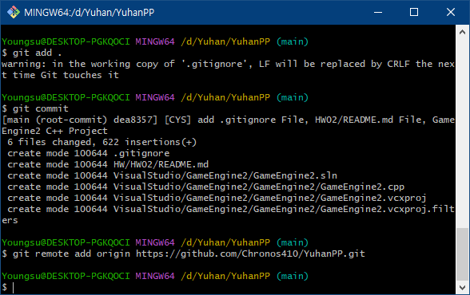

# 프로그래밍 패턴 2주차 과제에 오신 것을 환영합니다.


## <1> VCS란 무엇인가

Version Control System은 파일을 관리하는 방식 / 도구 중 하나이다.

파일을 변경점이 생김에 따라 여러가지 버전으로 나누어 저장, 관리한다.

이전 버전의 파일을 불러올 수 있게 해 복구와 여러 버전을 개발 하는 데에 도움이 되는 방식이다.

VCS는 이러한 접근 방식을 통해서 여러명의 개발자가 하나의 코드베이스나 문서에서 동시에 작업 할 수 있게 한다.

또한 모든 변경점을 기록하기 때문에 특정 버전에서 발생했을 수 있는 문제, 버그를 식별 할 수 있고, 이전 버전으로 쉽게 되돌릴 수 있다.

개발자들이 주 코드베이스 또는 문서의 개별 복사본인 브랜치를 만들어 안정성을 해치지 않고 실험 할 수 있으며 완성되면 주 코드베이스 또는 문서로 다시 병합하는 것이 가능하다.


* * *


## <2> DVCS와 VCS의 차이점

Distributed Version Control System은 오직 서버만이 모든 데이터를 가지고있던 기존의 방식과 달리 각 클라이언트 또한 서버처럼 데이터를 가지고 있는 방식의 버전 관리 시스템이다.

각각의 개발자가 모두 데이터를 가지고 있으므로 서버에 연결 되지 않는 상황에도 개발을 이어나갈 수 있다는 장점이 있다.

또한 누군가 서버와 데이터를 병합한 다음 문제가 발생 한 경우에도 모든 팀원에게 로컬 복사본이 있으므로 더욱 안정적으로 사용 할 수 있다.

GitLab에선 DVCS의 장점을 다음과 같이 서술했다.
	
	1. 안정적인 백업 복사본

	2. 빠른 병합 및 유연한 분기

	3. 신속한 피드백 및 병합 충돌 감소

	4. 오프라인으로 작업할 수 있는 유연성
	
	참고자료 : [Gitlab DVCS 소개글](https://about.gitlab.com/topics/version-control/benefits-distributed-version-control-system/#what-are-the-advantages-of-using-a-distributed-version-control-system, "Gitlab DVCS")


* * *


## <3> GIT을 이용해 remote repository, local repository 생성


#####


1. git init : 해당 폴더를 새로운 git repository로 설정한다. 사용시 .git이라는 숨김 폴더가 생성됨을 확인했다.


2. git branch -m master main : branch 이름을 master 에서 main으로 수정했다.


3. git add . : 해당 폴더에는 수업 시간에 이미 만들어둔 파일들이 있었는데 .을 사용해 폴더에 있는 모든 파일을(변경점을) commit의 영향에 들어가는 스테이징 영역에 추가했다.


4. git commit : add 명령어를 통해 스테이징 영역에서 대기하던 파일들을 commit 명령어로 git에 저장했다. 이 화면은 커밋 메세지를 입력하는 모습이다.


5. git commit 결과 : 커밋 메세지를 입력하고 난 결과 화면이다.


6. git remote add origin https://github.com/Chronos410/YuhanPP.git : remote repository와 연결하기 위해서 YuhanPP라는 이름으로 내 GitHub repository와 연결시켰다.


7. git push : 내가 commit한 내용을 remote repository(Github)으로 옮기는 push 명령어를 통해 Github과 내 로컬 저장소의 내용을 동기화시켰다.


* * *


## <4> .gitignore 의 사용법과 작성방식 및 내용에 대한 조사


.gitignore은 add 할 때 매번 제외시키기 귀찮은 불필요한 파일을 걸러주는 역할을 가진다.

.gitignore 파일 안에 제외할 내용을 적어 넣으면 자동으로 add에서 제외시켜준다.


>예시
>
>	> 파일 img.png를 제외하는 경우
>	>	>img.png
>	>
>	>폴더 img 내부의 모든 파일을 제외하는 경우
>	>	>img/
>	>
>	>폴더 img 내부의 모든 파일을 제외하지만 .png 확장자인 모든 파일은 예외로 하는 경우
>	>	>img/!*.png
>
>간단하게 응용해서 쓸 수 있는 방법들을 적어보았다.


* * *


## <5> README.md 파일에 사용 된 Mark Down 표기법에 대한 사용 방법 정리


1. 헤더

	헤더는 H1~H6까지 지원되며 #을 붙여서 사용한다

	>\# H1
	>
	>\## H2
	>
	>\### H3
	>
	>\#### H4
	>
	>\##### H5
	>
	>\###### H6

	# H1
	
	## H2

	### H3
	
	#### H4
	
	##### H5
	
	###### H6


2. 목록(숫자)

	숫자 목록은 다음과 같이 사용한다

	1\. 일

	2\. 이

	3\. 삼

	>1. 일
	>
	>2. 이
	>
	>3. 삼


3. 순서 없는 목록

	\* , \- , \+ 를 사용 할 수 있다
	>*하나
	>
	>*둘
	>
	>*셋
	>
	>-하나
	>
	>-둘
	>
	>-셋
	>
	>+하나
	>
	>+둘
	>
	>+셋
	>


4. 코드

1. 들여쓰기

	탭 또는 공백 4번으로 들여쓰기를 할 수 있다.
	
	들여쓴 문장부터 들여쓰지 않은 문장을 만날 때 까지 유지된다.


2. 코드 블럭
	
	\```내용```를 이용해서 코드 블럭을 만들 수 있다.

	\<pre>\<code>{내용}\</code>\</pre>를 사용하는 것으로도 코드 블럭을 만들 수 있다.


5. 수평선


	수평선은 

	\* \* \*

	\*\*\*

	\*\*\*\*\*

	\- \- \-

	\-\-\-\-\-\-\-\-\-\-\-\-\-\-\-\-\-\-\-\-\-\-\-\-\-\-\-\-\-\-\-\-\-\-\-\-\-\-\-

	모두 사용 가능 하다

	* * *


6. 링크

	1. 참조 링크

		\[link keyword][id]

		\[id]: URL "Optional Title here"


	2. 외부 링크

		\[Title](link)


	3. 링크 자동 연결
	
		일반적인 URL이나 이메일은 자동으로 잡아준다.

		예시 : https://example.com/


7. 이미지

	\![Alt text]\(/path/to/img.jpg)를 사용하거나


	HTML을 이용해서 

	\\</img>

	같이 생성 할 수 있다.


8. 강조

	\**single asterisks*\*
	
	\__single underscores_\_
	
	\*\***double asterisks**\*\*
	
	\_\___double underscores__\_\_
	
	\~\~~~cancelline~~\~\~


사실은 이미 잘 정리되어있는 자료의 도움을 받아 아주 쉽게 본문에 적용해 보았다.

참고자료 : [MarkDown 사용 방법 정리글](https://gist.github.com/ihoneymon/652be052a0727ad59601, "MarkDown 정리글")